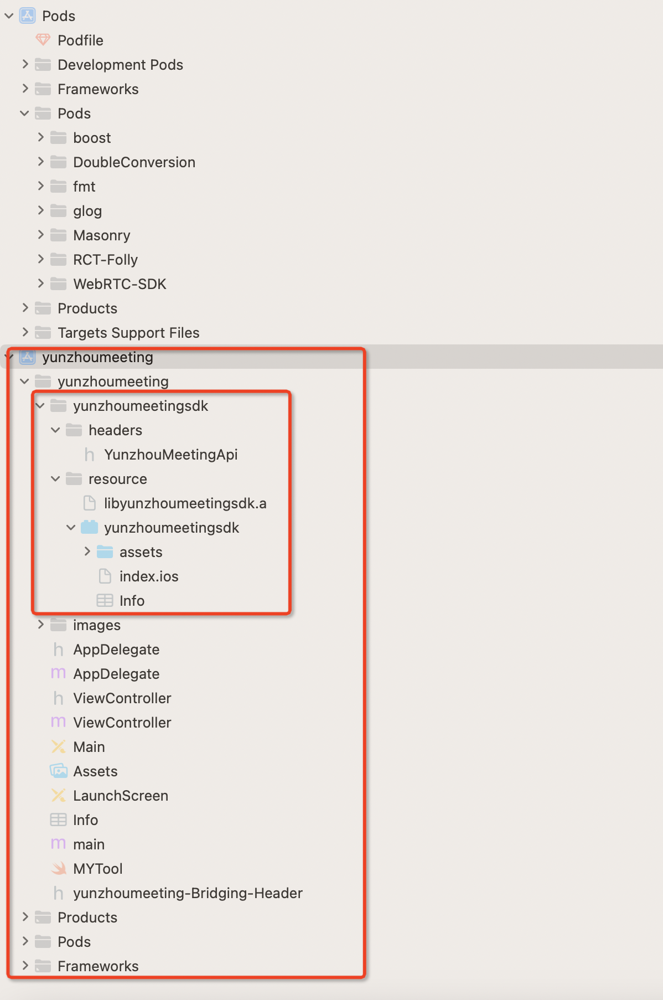

# yzmeeting-example-ios

# 概述

随着云视频会议的越来越普及，企业沟通中随时拉会的场景越来越多，云舟会议赋能企业内部各种应用随时拉起视频通话或者视频会议，让您的应用轻松插上即时通话和会议的翅膀。

云舟会议SDK是自带UI功能的音视频通话和音视频会议SDK，具有如下特点：
1. 集成简单：用户只需简单几行代码就可以拥有私有化部署的音视频通话和音视频会议的功能；
2. 功能全面：具备了会议创建，会议加入，呼叫，被叫，共享桌面，录制，会控等音视频会议的常用功能；
3. 平台能力稳定：音视频会议基于稳定的RTC平台构建，具备网络切换，断网重连，弱网重传等功能。支持H264和AV1等先进的编码方式，保证了低码率和画质。
4. 私有化部署：满足企业安全需求，方便企业资产结算。

# 集成必读

在集成SDK之前，需要做如下提前准备：
1. 需要部署好音视频服务端，确认好会议服务器的地址和端口;
2. 集成本SDK的APP需要有用户体系，调用SDK时需要指定用户名，用户ID，用户头像地址这些用户信息；
3. 集成会议功能时，集成本SDK的APP需要提供创建会议或者加入会议的入口交互能力，如果是加入会议则需要提供会议号;
4. 集成通话功能时，集成本SDK的APP的系统需要具备推送机制，APP需要具备呼叫入口交互能力，接收呼叫推送后调起本SDK的被叫接口;
5. 获取SDK， IOS SDK从如下repo下载: https://github.com/yunzhoucomm/yzmeeting-sdk-ios.git

# 快速开始

## 集成准备

### 开发环境要求

项目最低支持版本iOS 12.0及以上
Xcode14及以上
运行在真机iOS12.0的系统及以上

### 获取会议服务器地址
如果自己部署会议服务器，会议服务器地址为自己部署的会议服务器地址
如果需要使用云舟会议服务器，请联系支持人员

### 获取node_modules
先安装Node.js，从[官网](https://nodejs.org/en)下载最新的LTS版本。输入命令`node -v`，`npm -v`检查是否安装成功。

再安装yarn，输入命令`yarn -v`检查是否安装成功。

```
npm install -g yarn
```
检查cocoapods环境
```
pod --version
```
如果没有安装cocoapods
```
sudo gem install cocoapods
```
拷贝SDK文件夹里面的package.json，podfile以及Podfile_ReactNative.rb文件（和项目的project目录平级），cd到改目录，执行
```
pod install
```
podfile文件会自动执行Podfile_ReactNative.rb脚本，自动判断是否存在node_modules和rn环境，不存在会自动搭建环境和获取node_modules文件

## 手动集成步骤
### 导入SDK文件夹
该SDK为静态库，里面包含.a文件和bundle资源文件。
将SDK文件夹引入到项目，如下图：


### 导入头文件
在需要实现功能的类中导入头文件
```
#import "YunzhouMeetingApi.h"
```
## 接口说明
### 启动会议
```
/**
 * startWithController // yunzhoumeeting SDK 入口
 *
 * @param viewController       需要弹出视图的控制器
 * @param options              传入参数信息 ： （userInfo, serverUrl）
 * @param meetingType          进入会议类型（创建会议 / 加入会议）
 *
 */
- (void)startWithController:(UIViewController *)viewController options:(NSDictionary *)options meetingType:(EntryType)entryType;

```
```
startWithController方法参数说明：

| 参数           | 含义                                                    |
| :------------- | ------------------------------------------------------ |
| viewController | 需要弹出视频会议的控制器（一般为最上层控制器）                 |
| options        | options对象，包装会议信息的参数         |
| entryType      | 会议类型，枚举，决定是加入会议还是创建会议                    |

options参数说明：

| 参数           | 含义                                                    |
| :------------- | ------------------------------------------------------- |
| userInfo        | 设置参会人信息，构造参数依次为用户id， 用户名，用户头像 |
| serverUrl       | 设置会议服务器地址  

entryType入会类型枚举参数说明:

typedef NS_ENUM(NSUInteger, EntryType) {
    EntryType_Meeting_Creat    = 0,         // 创建会议
    EntryType_Meeting_Join     = 1,         // 加入会议
    EntryType_Call_Start       = 2,         // 发起呼叫
    EntryType_Call_Receive     = 3,         //收到呼叫
};
```

代码调用示例如下：
```
    [[YunzhouMeetingApi sharedInstance] startWithController:self options:@{
         //请传入您的应用的用户信息。包含userId, userName, avatar，本示例填入的信息需要修改
        @"userInfo" : userDic,    
        //请传入您要连接的媒体服务器的地址和端口号
        @"serverUrl" : @"https://your_meeting_server_url.com:xxx" 
    } meetingType:EntryType_Meeting_Creat];

    NSDictionary *userDic = @{@"userId" : [NSString stringWithFormat:@"%ld", [self generateRandomNumberWithDigits:6]],
                              @"userName" : [NSString stringWithFormat:@"demo-user%ld", [self generateRandomNumberWithDigits:3]],
                              @"avatar" : @"http://your_user_info_url.com:xxx/photos/4dde5410e72f9440e510735638723358"
    };    
```

# 常见问题

## iOS

1.因为在会议当中可能会用到强制旋转屏幕的功能，并且该SDK依赖react-native-orientation-locker，所以记得在适当位置实现,可根据自己的项目进行修改
```
- (UIInterfaceOrientationMask)application:(UIApplication *)application supportedInterfaceOrientationsForWindow:(UIWindow *)window {
  return [Orientation getOrientation];
}
```
2.如果在pod install阶段出现
```
[!] Unable to determine Swift version for the following pods:

- `react-native-receive-sharing-intent` does not specify a Swift version and none of the targets (`video`) integrating it have the `SWIFT_VERSION` attribute set. Please contact the author or set the `SWIFT_VERSION` attribute in at least one of the targets that integrate this pod.
```
是因为原因工程中没有设置SWIFT_VERSION，为空，而依赖的第三方库使用了swift。
参考[此文章](https://blog.51cto.com/u_15755990/5589024)解决

3.项目需要支持摄像机，麦克风，网络等权限，可以在项目的info.plist文件当中添加
```
    <key>NSMicrophoneUsageDescription</key>
    <string>麦克风权限</string>
    <key>NSCameraUsageDescription</key>
    <string>摄像机权限</string>
    
    <key>NSAllowsArbitraryLoads</key>
		<true/>
```
4.如果在xcode15上面运行demo，如果在hash.hpp文件中出现下面代码报错，是因为在RTC-Folly的三方库没有进行xcode15的适配，可以根据xcode引导进行修改
```
#else template <typename T> struct hash_base : std::__unary_function<T, std::size_t> {}; #endif
```
修改为
```
#else template <typename T> struct hash_base : std::unary_function<T, std::size_t> {}; #endif
```
